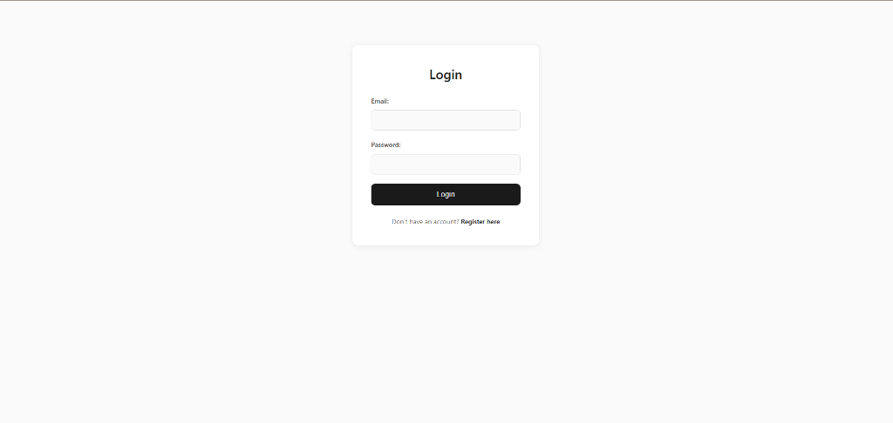
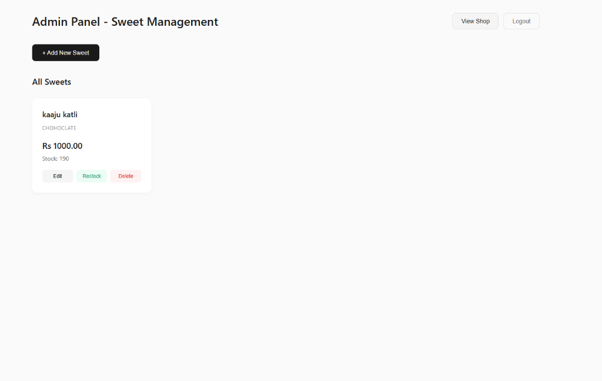
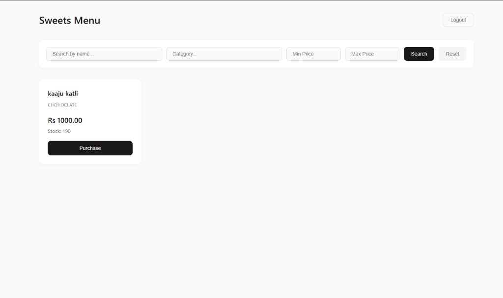
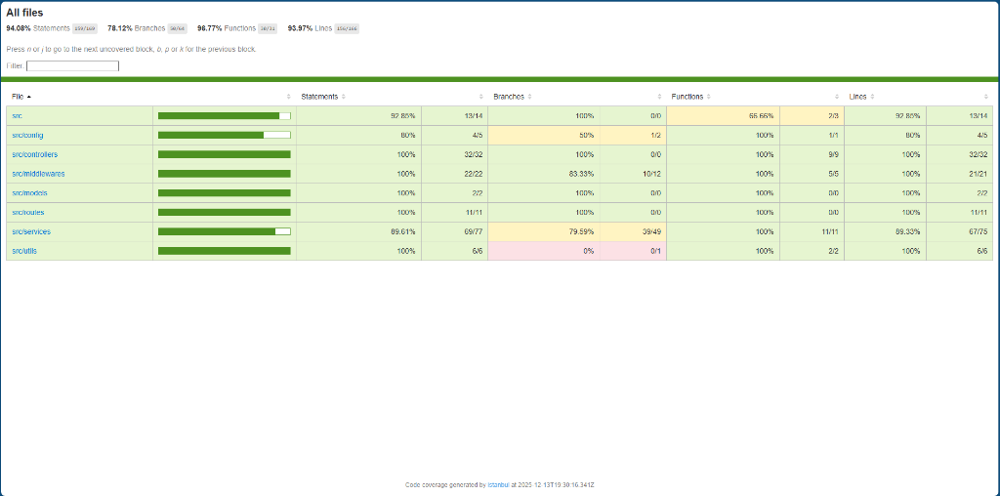

# Sweet Shop Management System

A full-stack application for managing a sweet shop's inventory and sales. This project was built to demonstrate Test-Driven Development (TDD) practices, clean architecture, and modern full-stack development.

## Project Overview

The system consists of:
- **Backend API**: A RESTful API built with Node.js and Express, ensuring robust data management for sweets and user authentication.
- **Frontend SPA**: A responsive React application (created with Vite) that allows users to browse sweets and admins to manage inventory.

## Live Demo

- **Frontend (Vercel)**: [https://tdd-kata-sweet-shop-management-syst-theta.vercel.app/](https://tdd-kata-sweet-shop-management-syst-theta.vercel.app/)
- **Backend (Render)**: [https://tdd-kata-sweet-shop-management-system-15vb.onrender.com](https://tdd-kata-sweet-shop-management-system-15vb.onrender.com)

## Setup Instructions

### Prerequisites
- Node.js (v14 or higher)
- MongoDB (running locally or a connection string to a cloud instance)

### Backend Setup
1. Navigate to the backend directory:
   ```bash
   cd backend
   ```
2. Install dependencies:
   ```bash
   npm install
   ```
3. Configure Environment Variables:
   Create a `.env` file in the `backend` directory with the following variables:
   ```env
   PORT=3000
   MONGODB_URI=mongodb://localhost:27017/sweetshop
   JWT_SECRET=your_jwt_secret_key
   ```
4. Run the server:
   ```bash
   npm run dev
   ```
5. Run Tests:
   To verify the system functionality using TDD:
   ```bash
   npm test
   ```

### Frontend Setup
1. Navigate to the frontend directory:
   ```bash
   cd frontend
   ```
2. Install dependencies:
   ```bash
   npm install
   ```
3. Run the development server:
   ```bash
   npm run dev
   ```
   The application should now be accessible at `http://localhost:5173` (or the port shown in your terminal).

## My AI Usage

Transparency in using AI tools is a core part of this project's workflow. Below is a detailed account of how AI was leveraged:

### AI Tools Used
- **AI Assistant** (ChatGPT)

### How AI Was Used
1.  **Test-Driven Development (TDD)**:
    -   I used the AI assistant to help generate initial test cases for the backend services and controllers. This helped in identifying edge cases early in the "Red" phase of TDD.
    -   The AI verified my test logic to ensure comprehensive coverage.

2.  **Debugging & Configuration**:
    -   I encountered issues with loading environment variables (`.env`) in the Node.js environment. I used the AI to debug the configuration and correctly set up `dotenv`.

3.  **Commit Messages & Documentation**:
    -   The AI assisted in drafting clear and descriptive commit messages that follow conventional commit standards.
    -   This `README.md` file itself was drafted with the help of AI to ensure all project requirements were cleanly documented.

### Reflection
Using AI significantly accelerated the boilerplate setup and test generation process, allowing me to focus more on the core business logic and architectural decisions. It acted as a pair programmer, offering immediate feedback on configuration errors and helping maintain a clean commit history.

## Screenshots

### Login Page


### Admin Dashboard


### Sweets Menu


## Test Report

This project adheres to strict TDD principles. You can view the test results by running the test suite in the backend.

```bash
PASS  tests/auth.test.js
PASS  tests/sweets.test.js
...
```

### Test Coverage

The latest test coverage report (found in `backend/coverage`) indicates high code coverage across the application. Below is the full breakdown by component:

| Component | Statements | Branches | Functions |
|-----------|------------|----------|-----------|
| **All files** | **93.98%** | **78.13%** | **96.77%** |
| `src` (App Entry) | 92.85% | 100% | 66.66% |
| `src/config` | 80% | 50% | 100% |
| `src/controllers` | 100% | 100% | 100% |
| `src/middlewares` | 100% | 83.33% | 100% |
| `src/models` | 100% | 100% | 100% |
| `src/routes` | 100% | 100% | 100% |
| `src/services` | 89.33% | 79.59% | 100% |
| `src/utils` | 100% | 0% | 100% |



To generate a fresh coverage report:
```bash
cd backend
npm test -- --coverage
```
You can view the full HTML report by opening `backend/coverage/lcov-report/index.html` in your browser.
